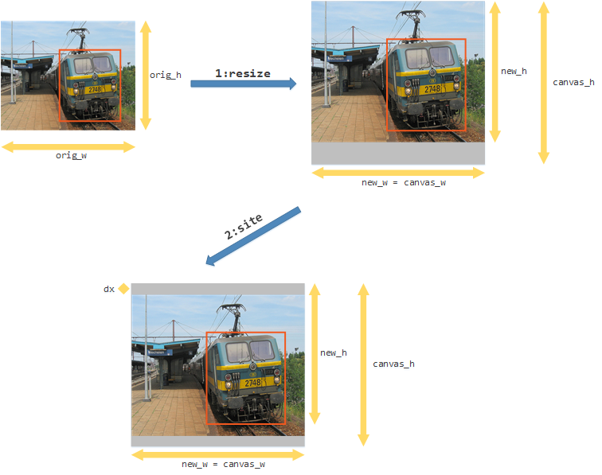
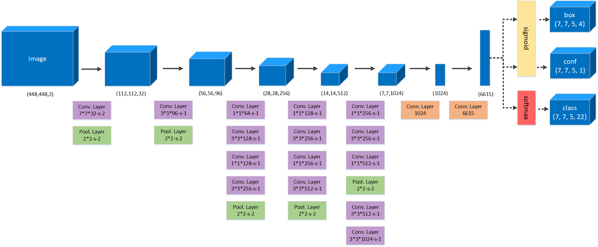

## How to improve the performance of object detection system

### 1 Problem

Object detection is a computer technology related to computer vision and image processing that deals with detecting instances of semantic objects of a certain class (such as humans, buildings, or cars) in digital images and videos. There are several key steps in existing object detection systems, such as hypothesizing bounding boxes, resampling pixels or features for each box, and applying a high- quality classifier. Two fractions develop gradually because of different kernel goal. The two-stage detectors focus on the accuracy of object detection, which first generates a set of candidate bounding boxes and then  selects and revises target bounding boxes, such as, R-CNN [1], Fast R-CNN [2], Faster R-CNN [3], Mask R-CNN [4], FPN [5]. In contrast, the one-state detectors focus on the efficiency of object detection, which regresses object boxes directly in an end-to-end framework, such as, SSD [6], YOLO [7], YOLOv2 [8], RetinaNet [9].

In this article, I fuse YOLO and YOLOv2 as the basic model and propose several techniques and tricks to improve the performance of object detection system. In order to experiments the model, I use benchmark dataset (PASCAL-VOC 2012) [10]. Here is the step of downloading and processing the dataset.

```shell
1. mkdir `datasets` in the root directory
2. cd `datasets`
3. wget `http://cvlab.postech.ac.kr/~mooyeol/pascal_voc_2012/VOCtrainval_11-May-2012.tar`
4. tar -xvf VOCtrainval_11-May-2012.tar
Now there is a directory `VOCdevkit` in `yolo-tensorflow/datasets/`
5. cd .. to root directory
6. python -m src.tools.datasets
Now there is a directory `voc` in `yolo-tensorflow/datasets`
```


### 2 Models

#### 2.1 basic model

##### 2.1.1 data pre-processing

The VOC dataset has 5717 training images, 2911 validation images and 2912 testing images. Because each image has different scales, it is necessary to resize each image to a fixed size, I set (448,448,3) following YOLO [7]. In detail, I first create a canvas whose size is (448,448,3) and filled with neutral gray color. Then I scaling the original image according to original size. Finally, I put the resized image in the middle of the canvas. **It is important that adjusting the ground truth bounding boxes when processing image**. Here is an example of data pre-processing. In order to minimize the time consuming in data pre-processing, I use  the shared memory technique introduced in article `机器学习中如何“优雅地”处理数据` [11].



##### 2.1.2 network backbone

Similar to YOLO model, I create the deep convolutional neural network as the backbone. In consideration of the complicated representation and efficient calculation, I set 15 convolutional layers, 5 max pooling layers as well as 2 dense layers. Here is the backbone of network.



The output of the network is consist of 3 tensors, each represent bounding box, confidence and classification. That is to say, I assume that the output feature has 7*7 cells and each cell has 5 bounding boxes. Thus, the network can predict 245 objects at most in one image. Clearly, each cell in the image has the ability of feeling positional information of objects and each bounding box in the cell has the ability of feeling size information of objects. Each bounding box has 27 information in order. 

The first 1 value represents the confidence which means 'here is an object' if conf >= 0.5 and 'here is no object' if conf < 0.5. The confidence value is in the interval [0,1]. The next 4 values represent the coordinate which contains x axis of center, y axis of center, width of box and height of box. The 4 coordinate values is in the interval [0,1]. The last 22 values represent the probability of each class and the sum of these 22 values is equal to 1.

##### 2.1.3 objective function

After network calculation, I get 7\*7\*5 bounding boxes in an image, which have different position and size. Then, it is important to select several bounding boxes as **target boxes** to predict ground truth objects. The target box is a member of bounding boxes and matches an ground truth object. The center coordinates of the target box and the corresponding ground truth object are located at the same cell. In addition, the intersection over union (IOU) of the target box and the corresponding ground truth object is the greatest compared with other bounding boxes in this cell. In detail, if several ground truth objects match the same target box, then the greatest IOU ground truth object will be kept and other ground truth objects will be missed. In other words, a target box matches only one ground truth object and a ground truth object may match no target box. Thus, I can get target boxes by above calculation and introduce the objective function.

The objective function is consists of 4 sub objective functions which are no-object function, object function, coordinate function and classification function. These sub objective functions are all l2 loss function. Next, I will introduce each of them.

**no-object function:** no-object function represents the loss of confidence based on the bounding boxes which are not target boxes. Here is the equation.
$$
loss_{noobj} = \sum_{x=1}^X \sum_{y=1}^Y \sum_{n=1}^N (1 - {\bf{1}}_{xyn}^{target}) \cdot ( \hat{c}_{xyn} - c_{xyn} ) ^2
$$


**object function:** object function represents the loss of confidence based on the target boxes. Here is the equation.
$$
loss_{obj} = \sum_{x=1}^X \sum_{y=1}^Y \sum_{n=1}^N {\bf{1}}_{xyn}^{target} \cdot ( \hat{c}_{xyn} - c_{xyn} ) ^2
$$


**coordinate function:** coordinate function represents the loss of 4 coordinates based on the target boxes. Here is the equation.
$$
loss_{coord} = \sum_{x=1}^X \sum_{y=1}^Y \sum_{n=1}^N {\bf{1}}_{xyn}^{target} \cdot [ ( \hat{x}_{xyn} - x_{xyn} ) ^2 + ( \hat{y}_{xyn} - y_{xyn} ) ^2 + ( \hat{w}_{xyn} - w_{xyn} ) ^2 + ( \hat{h}_{xyn} - h_{xyn} ) ^2 ]
$$


**classification function:** coordinate function represents the loss of 4 coordinates based on the target boxes. Here is the equation.
$$
loss_{cls} = \sum_{x=1}^X \sum_{y=1}^Y \sum_{n=1}^N {\bf{1}}_{xyn}^{target} \cdot \sum_{k=1}^K ( \hat{p}_{xynk} - p_{xynk} ) ^2
$$


The final loss function is the sum of these 4 sub loss functions.
$$
Loss = \lambda_{noobj} \cdot loss_{noobj} + \lambda_{obj} \cdot loss_{obj} + \lambda_{coord} \cdot loss_{boord} + \lambda_{cls} \cdot loss_{cls}
$$

##### 2.1.4 evaluation

**mean average precision (mAP)** is the most common evaluation in object detection task. After predicting some target boxes at given confidence threshold, I match target boxes to ground truth objects. The **true positive boxes** has IOU >= 0.5 with corresponding ground truth objects and the **false positive boxes** has IOU < 0.5 with corresponding ground truth objects. Then, I get precision which is number of true positive boxes divided by the number of ground truth objects and recall which is number of true positive boxes divided by the sum of true positive boxes and false positive boxes. I can get a tuple of precision and recall at each confidence threshold. Thus, the precision is increasing and the recall is decreasing along with the increasing of confidence threshold. The area of this curve surrounded by the x and y axis is the AP value. I get a mean value of each AP in different class, namely mean average precision (mAP).


### 3 Experiments

#### 3.1 basic model

I set image size as (448,448,3), cell size as (7,7), number of bounding boxes in each cell as 5, the learning rate as 0.0001, the no-object lambda as 1, the object lambda as 1, the coordinate lambda as 1, the classification lambda as 1, the update method as momentum with 0.9 decay. These parameters are set simply without any tuning. I train the basic model by 200000 iterations and calculate mAP value on validation set every 1000 iterations. Here is the curve of mAP in each evaluation iteration.


### Reference

[1]. Girshick R, Donahue J, Darrell T, et al. Region-Based Convolutional Networks for Accurate Object Detection and Segmentation. on PAML, 2015.

[2]. Girshick, R. Fast r-cnn. in ICCV, 2015.

[3]. Ren, S., He, K., Girshick, R., & Sun. Faster r-cnn: Towards real-time object detection with region proposal networks. in NIPS, 2015.

[4]. He K, Gkioxari G, Dollár P, et al. Mask R-CNN. in ICCV, 2017.

[5]. Lin T Y, Dollar P, Girshick R, et al. Feature Pyramid Networks for Object Detection. in CVPR, 2017.

[6]. Liu W, Anguelov D, Erhan D, et al. SSD: Single Shot MultiBox Detector. in ECCV, 2016.

[7]. Redmon J, Divvala S, Girshick R, et al. You Only Look Once: Unified, Real-Time Object Detection. 2015.

[8]. Redmon J, Farhadi A. YOLO9000: Better, Faster, Stronger. 2016.

[9]. Lin T Y, Goyal P, Girshick R, et al. Focal Loss for Dense Object Detection. in ICCV, 2017.

[10]. <http://cvlab.postech.ac.kr/~mooyeol/pascal_voc_2012/VOCtrainval_11-May-2012.tar>

[11]. https://zhuanlan.zhihu.com/p/31628847